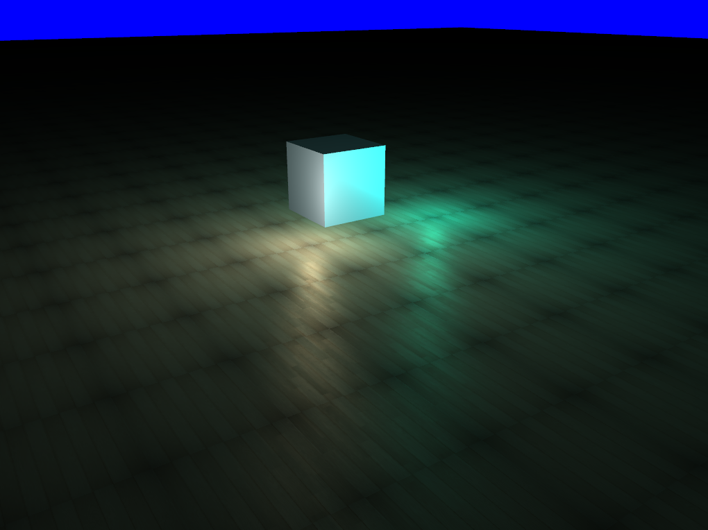

# Titan Engine

**Titan Engine** is a rendering engine (possibly also game engine in the future) which is small, lightweigth and easily customizable.

## Example

Piece of code that boots up the engine and draw the demo in the capture file :
	
	int main()
	{
	    display mainDisplay = display();
	    mainDisplay.init(1024,768,4);

	    scene myscene = scene();
	    myscene.setupDisplay(&mainDisplay,CAMERA_FPS);

	    float colors[] = {...};

	    cube thecube = cube();
	    thecube.setData(colors,"light_basic");
	    myscene.addDrawableObject(&thecube);
	    thecube.moveObject(glm::vec3(0,0,-5));
	    thecube.setSpecularStrenght(1.0);

	    plane myplane = plane();
	    myplane.setData(colors,"light_basic",texcoord,"texture.jpg");
	    myscene.addDrawableObject(&myplane);
	    myplane.moveObject(glm::vec3(0,-1,-2));
	    myplane.scaleObject(glm::vec3(10,10,10));
	    myplane.setSpecularStrenght(0.2);

	    light mylight1 = light();
	    mylight1.setData(glm::vec3(-3,1,2),glm::vec3(1.0,0.0,0.0),glm::vec3(0,0,-1),1000.0f);
	    myscene.addLight(&mylight1);
	    mylight1.type = POINT_LIGHT;

	    light mylight2 = light();
	    mylight2.setData(glm::vec3(3,1,2),glm::vec3(0.0,0.0,1.0),glm::vec3(0,0,-1),1000.0f);
	    mylight2.type = POINT_LIGHT;
	    myscene.addLight(&mylight2);

	    light mylight3 = light();
	    mylight3.setData(glm::vec3(0,1,2),glm::vec3(0.0,1.0,0.0),glm::vec3(0,0,-1),1000.0f);
	    mylight3.type = POINT_LIGHT;
	    myscene.addLight(&mylight3);

	    while(!mainDisplay.shouldExit()){
	        mainDisplay.clearWindow();
	        myscene.updateFPSCamera();
	        myscene.renderScene();
	        mainDisplay.refreshWindow();
	    }

	    return 0;
}

## Actual supported features:
- Runs on Windows, Mac & Linux (32-64 bits)
- Support up to 7 seven lights at the same time
- Directionnal, spot and point light supported
- Ambiant, diffuse and specular shading
- For point and spot light, linear, constant and quadratic parameters are customizable.
- Diffuse map (up to 4 textures on a single object)
- Specular map
- OBJ Model loader
- Automatic texture cache

## Build
In order to use & build the project with this library, you must install the following libraries :
- GLFW
- OpenGL
- GLEW
- GLM  
If you use the sln solution, keep in mind that everything is 64-bit oriented.