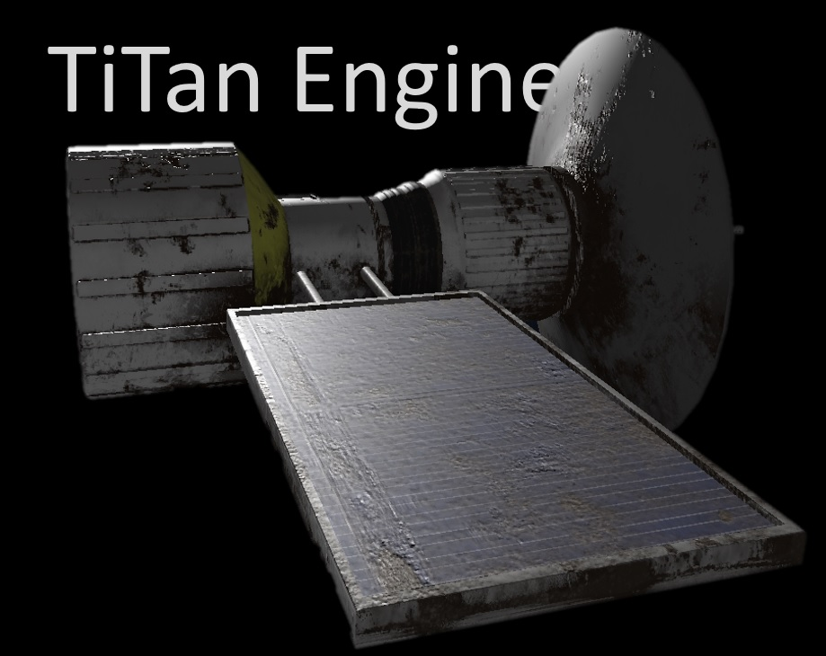
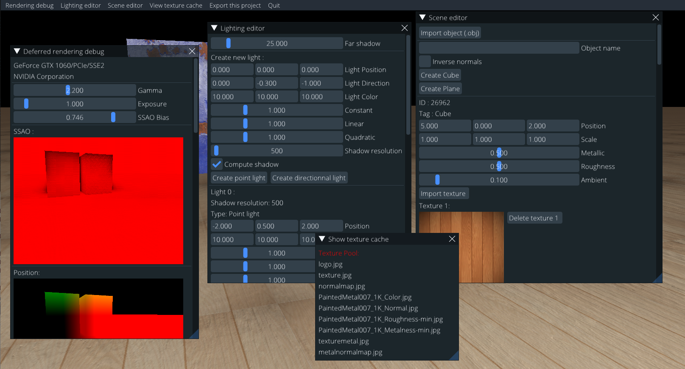
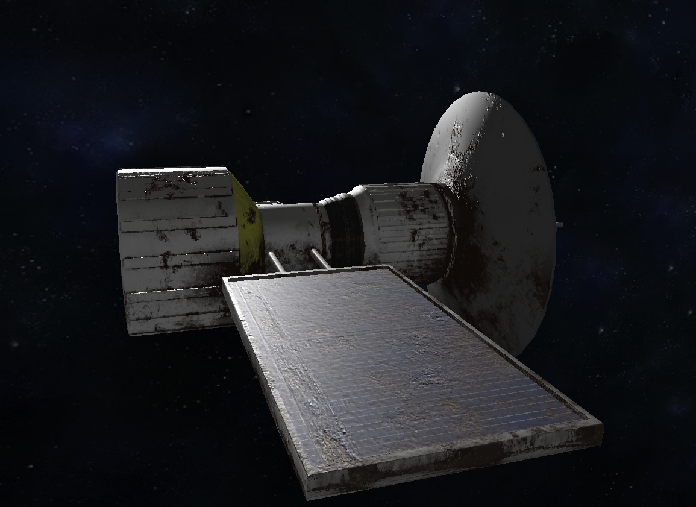

# Titan Engine

**Titan Engine** is a powerfull & lightweight game engine aimed to create minimalist 2D games as well as
big 3D open-worlds full of details.  
The final goal is to have a simple visual editor to easily build great games without the need to code, but the editor will support TitanScripting, an easy to understand language to interact with the world.

## Example
**Actual** GUI editor state:

PBR example :

Shadow example :

## Actual supported features:
- Runs on Windows, Mac & Linux (32-64 bits)
- Infinite number of lights
- Directionnal, spot and point light supported
- Physically Based Rendering (PBR)
- SSAO
- Albedo map
- Metallic map
- Roughness map
- Normal map
- Gamma correction
- HDR
- Deferred Shading
- Deferred Transparency
- Dynamic shadows
- OBJ Model loader
- Automatic texture cache
- GUI

## Currently working on (top is prioritized) :
- AO map (priority)
- TitanScripting to enable users exporting their game using TitanEngine (priority)
- Engine GUI to create beautiful games without needing to code ! (priority)
- Physics system
- Dynamic light frustrum

## Build
- Everything is setup, just run the sln solution :).
- If you are not targeting Microsoft Windows, please update the **libraries** folder.
- C++ 17 is used

## License
Please contact me before considering using any code from this repository.